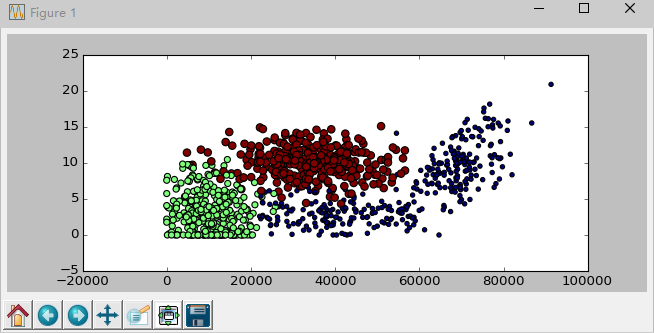

###K-近邻算法概述



k-近邻算法采用测量不同特征值之间的距离方法进行分类
```
优点：精度高、对异常值不敏感、无数据输入设定
缺点：计算复杂度高、空间复杂度高
适用数据范围：数值型和标称型
```
原理：存在一个样本数据集合，成为训练样本集，并且样本集中每个数据都存在标签，即我们知道样本集中每一数据与所属分类的对应关系。输入没有标签的新数据后，将新数据的每个特征与样本集中数据对应的特征进行比较，然后算法提取样本集中特征最相似数据（最近邻）的分类标签。我们只选择样本数据集中前k个最相似的数据，这就是k-近邻算法中k的出处，通常k是不大于20的整数。
####k-近邻算法的一般流程
1. 收集数据：可以使用任何方法
2. 准备数据：距离计算所需要的数值，最好是结构化的数据格式
3. 分析数据：可以使用任何方法
4. 训练数据：k-近邻算法不需要训练
5. 测试算法：计算错误率（准确率）
6. 使用算法：输入样本数据和结构化的输出结果，运行k-近邻算法判定输入数据分别属于哪个分类

#####k-近邻算法伪代码：
* 对未知的类别数据集中的每个点执行以下操作：
* 计算已知类别数据集中的点与当前点之间的距离；
* 按照距离递增次序排序；
* 选取与当前点距离最小的k个点；
* 确定前k个点所在类别出现的频率；
* 返回前k个点出现频率最高的类别作为当前点的预测分类

#####关键代码：
```
def classifyKNN(inX,dataset,labels,k):
     datasetSize=dataset.shape[0]
     diffMat=tile(inX,(datasetSize,1))-dataset
     sqDiffMat=diffMat**2
     sqDistances=sqDiffMat.sum(axis=1) #同行各列相加操作
     distances=sqDistances**0.5
     sortedDistIndicies=distances.argsort()
     classCount={}
     for i in range(k):
          voteIlabel=labels[sortedDistIndicies[i]]
          classCount[voteIlabel]=classCount.get(voteIlabel,0)+1
     sortedClassCount=sorted(classCount.iteritems(),key=operator.itemgetter(1),reverse=True)
     return sortedClassCount[0][0]
```
这里`numpy`的`tile`函数好好学习一下：[Numpy的tile函数 ](http://blog.csdn.net/qinning199/article/details/26158289)

在计算两个对象之间的距离时，除了欧式距离，还有其他的距离。

####归一化特征值：
```
def autoNorm(dataset):
     minVals=dataset.min(0)
     maxVals=dataset.max(0)
     ranges=maxVals-minVals
     normDataSet=zeros(shape(dataset))
     m=dataset.shape[0]
     normDataSet=dataset-tile(minVals,(m,1))
     normDataSet=normDataSet/tile(ranges,(m,1))
     return normDataSet,ranges,minVals
```

#####分类器针对约会网站的测试代码：
```
def datingClassTest():
     hoRatio=0.1
     datingDataMat,datingLabels=file2matrix('datingTestSet.txt')
     normDataSet,ranges,minVals=autoNorm(datingDataMat)
     m=normDataSet.shape[0]
     numTestVecs=int(m*hoRatio)
     errorCount=0
     for i in range(numTestVecs):
          classifierResult=classifyKNN(normDataSet[i,:],normDataSet[numTestVecs:m,:],datingLabels[numTestVecs:m],3)
          print "the classifier came back with:%d, the real answer is: %d" % (classifierResult,datingLabels[i])
          if(classifierResult!=datingLabels[i]):
               errorCount+=1
     print errorCount
     print "the total accuracy is:%f" % (1-float(errorCount)/float(numTestVecs))
```

2015-10-13 by Chunzhen