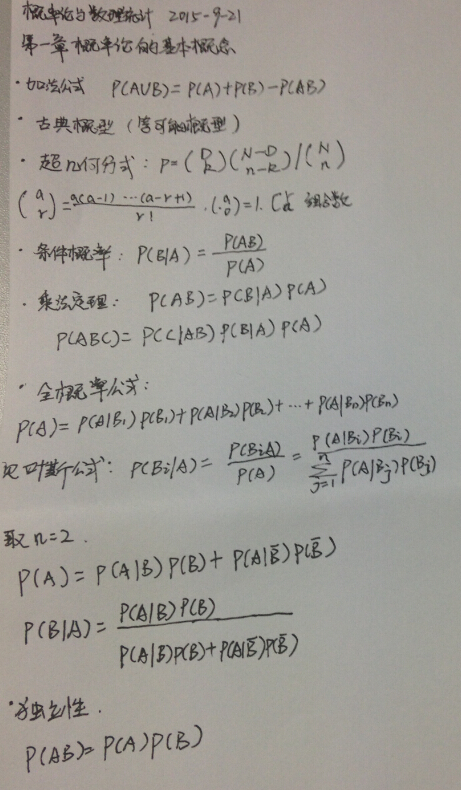

###基于概率论的分类方法：朴素贝叶斯



```
优点：在数据较少的情况下仍然有效，可以处理多类别问题
缺点：对输入数据的准备形式较为敏感
适用数据类型：标称型数据
```
`朴素（naive）`是指特征之间统计意义上独立，即一个特征或者单词出现的可能性与它和其他单词相邻没有关系

####条件概率
计算公式：p(A|B)=P(AB)/P(B)

####使用朴素贝叶斯进行文档分类
一般过程
1. 收集数据：任何方法
2. 准备数据：需要数值型或者布尔型数据
3. 分析数据：有大量特征时，绘制特征作用不大，此时使用直方图效果更好
4. 训练算法：计算不同独立特征的条件概率
5. 测试算法：计算错误率
6. 使用算法：一个常见的朴素贝叶斯应用是文档分类。

####获取文档集中所有出现的单词
```
def createVocabList(dataSet):
     vocabSet=set([])      #创建一个空集
     for document in dataSet:
          vocabSet=vocabSet | set(document)    #创建两个集合的并集
     return list(vocabSet)
```
####词集模型OR词袋模型
词集模型即只统计单词是否在文档中出现，即布尔类型。而词袋模型还统计单词在文档中出现的次数。相对来说，词袋模型包含更多的文档信息
```
#返回一个文档中哪些单词是否出现，出现为1，不出现为0，比计算次数
#词集模型
def setOfWords2Vec(vocabList,inputSet):
     returnVec=[0]*len(vocabList)
     for word in inputSet:
          if word in vocabList:
               returnVec[vocabList.index(word)]=1
          else:
               print "the word: %s is not in my Vocabulary!" % word
     return returnVec
```
```
#返回单词在文档中出现的次数
#词袋模型
def bagOfWords2VecMn(vocabList,inputSet):
     returnVec=[0]*len(vocabList)
     for word in inputSet:
          if word in vocabList:
               returnVec[vocabList.index(word)]+=1
     return returnVec
```
####朴素贝叶斯分类器训练函数
在一般计算概率的过程中会出现两个问题。

第一个问题是如果计算p(w0|1)p(w1|1)p(w2|1)，其中一个概率为0时，最后的成绩也为0。所以将所有单词初始化为1，并将分母初始化为2

第二个问题是`下溢出`，当在比较大的文档中，某些单词出现的次数很少，概率很小。而很多太小的数相乘程序下溢出就会四舍五入概率变为0。一种解决这个问题的方法对乘积取对数。
```
ln(a*b)=ln(a)+ln(b)
```
通过求对数可以避免下溢出或者浮点数舍入导致的错误。同时，采用自然对数处理不会有任何损失

####朴素贝叶斯训练器
```
#朴素贝叶斯训练器
#备注右侧代码为原始代码
#备注左侧代码即为修改后的代码，用来处理乘积为0的问题和下溢出问题
def trainNB0(trainMatrix,trainCategory):
     numTrainDocs=len(trainMatrix)
     numWords=len(trainMatrix[0])
     pAbusive=sum(trainCategory)/float(numTrainDocs)
     p0Num=ones(numWords)    #p0Num=zeros(numWords)
     p1Num=ones(numWords)    #p1Num=zeros(numWords)
     p0Denom=2    #p0Denom=0.0
     p1Denom=2    #p1Denom=0.0
     for i in range(numTrainDocs):
          if trainCategory[i]==1:
               p1Num+=trainMatrix[i]
               p1Denom+=sum(trainMatrix[i])
          else:
               p0Num+=trainMatrix[i]
               p0Denom+=sum(trainMatrix[i])
     p1Vect=log(p1Num/p1Denom)#p1Vect=p1Num/p1Denom
     p0Vect=log(p0Num/p0Denom)#p0DVect=p0Num/p0Denom
     return p0Vect,p1Vect,pAbusive
```
####二类问题的分类函数 
```
#vec2Classify为输入测试变量
def classifyNB(vec2Classify,p0Vect,p1Vect,pClass1):
     p1=sum(vec2Classify*p1Vect)+log(pClass1)
     p0=sum(vec2Classify*p0Vect)+log(1-pClass1)
     if p1>p0:
          return 1
     else:
          return 0
```

书中本章还实际运行例子去分类正常邮件和垃圾邮件，并使用朴素贝叶斯分类器从个人广告中获取区域倾向

* 交叉验证（10次）
* 分析RSS源文本，去除高频词汇。词汇表中的小部分单词占据所有文本用词的大部分，这是因为语言中大部分都是有冗余和结构辅助性内容。
* 去除停用词表（stop word list）：http://www.ranks.nl/resources/stopwords.html

