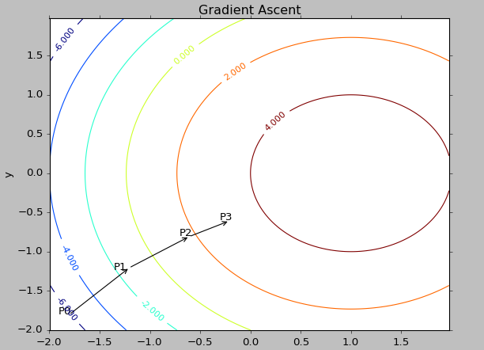
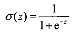
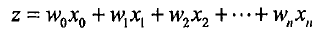
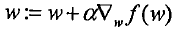

###Logistic回归



```
优点：计算代价不高，易于理解和实现
缺点：容易欠拟合，分类精度可能不高
适用数据类型：数值型和标称型数据
```

####Logistic回归是最优化算法
利用Logistic回归进行分类的主要思想是：根据现有数据对分类边界线建立回归公式，并以此进行分类。Logistic回归的大部分时间用于训练，训练的目的是为了找到最佳的分类回归系数


`单位阶跃函数`，即在一个x点，该函数从跳跃点上从0瞬间跳跃到1，这个跳跃的过程有时很难处理。可以用另一个函数`Sigmoid函数`来进行替换：



为了实现Logistic回归分类器，可以在每个特征都乘以一个回归系数，然后将所有的值相加，将这个总和带入Sigmoid函数中，进而得到一个范围在0-1之间的数值。任何大于0.5的数据被分入1类，小于0.5即被归为0类。所以，Logistic回归可以被看成一种概率评估。

####基于最优化方法的最佳回归系数确定
Sigmoid函数的输入为z：



梯度上升法:要找到某函数的最大值，最好的方法是沿着该函数的梯度方向去探寻。

梯度算子总是指向函数值增长最快的方向。而每次移动的量称为步长，记为a。



以之相对的是梯度下降算法。梯度上升算法用来求函数的最大值，而梯度下降算法用来求函数的最小值。

#####梯度上升法的伪代码：
```
每个回归系数初始化为1：
重复R次：
  计算整个数据集的梯度
  适用alpha * gradient 更新回归系数的向量
  返回回归系数
```

```python
def gradAscent(dataMatIn,classLabels):
     dataMatrix=mat(dataMatIn)
     labelMat=mat(classLabels).transpose()
     m,n=shape(dataMatrix)

     alpha=0.001
     maxCycles=500
     weights=ones((n,1))
     for k in range(maxCycles):
          h=sigmoid(dataMatrix*weights)
          error=(labelMat-h)
          weights=weights+alpha*dataMatrix.transpose()*error
     return weights
```
####训练算法：随机梯度上升
梯度上升算法在每次更新回归系数时都需要遍历整个数据集，该方法的计算复杂度太高。一种改进的方法是一次仅用一个样本来更新回归系数，称为随机梯度上升算法
伪代码如下：
```
所有回归系数初始化为1
对数据集中每个样本
  计算该样本的梯度
  适用alpha * gradient更新回归系数值
返回回归系数值
```
```python
def stocGradAscent0(dataMatrix, classLabels):
    m,n = shape(dataMatrix)
    alpha = 0.01
    weights = ones(n)   #initialize to all ones
    for i in range(m):
        h = sigmoid(sum(dataMatrix[i]*weights))
        error = classLabels[i] - h
        weights = weights + alpha * error * dataMatrix[i]
    return weights
```
而上述算法不足之处是会受一些不能正确分类的样本点影响，收敛存在一些小周期的波动。
####改进的随机梯度上升算法
如下所示：
```python
def stocGradAscent1(dataMatrix, classLabels, numIter=150):
    m,n = shape(dataMatrix)
    weights = ones(n)   #initialize to all ones
    for j in range(numIter):
        dataIndex = range(m)
        for i in range(m):
            alpha = 4/(1.0+j+i)+0.0001    #apha decreases with iteration, does not
            randIndex = int(random.uniform(0,len(dataIndex)))#go to 0 because of the constant
            h = sigmoid(sum(dataMatrix[randIndex]*weights))
            error = classLabels[randIndex] - h
            weights = weights + alpha * error * dataMatrix[randIndex]
            del(dataIndex[randIndex])
    return weights
```
这章比较懒。。。！

By Chunzhen 2015-10-26


