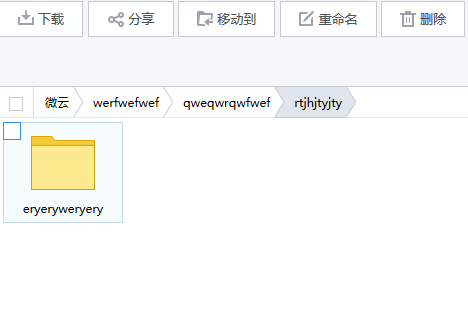
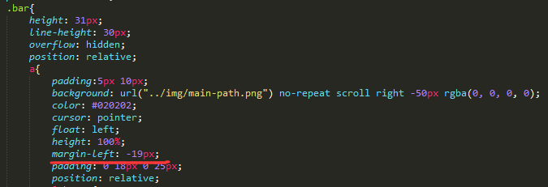
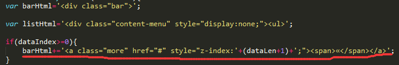

###腾讯云盘的导航栏简单实现




首先这个导航栏是这样子的，然后当屏幕过小的时候，部分超过屏幕的导航会压缩。任务很简单，就是按照云盘的方式实现一个相似的导航栏。

实现过程中，我想把这个导航写成一个jQuery插件的形式，所以就搜索了jQuery插件的写法。看到这篇文章 [什么？你还不会写JQuery 插件] (http://www.cnblogs.com/joey0210/p/3408349.html)照样画葫芦，其中jQuery插件的通用代码如下：

```javascript
//完整的高亮插件代码如下：
(function ($) {
    $.fn.extend({
        "highLight": function (options) {
            //检测用户传进来的参数是否合法
            if (!isValid(options))
                return this;
               //使用jQuery.extend 覆盖插件默认参数
            var opts = $.extend({}, defaluts, options);
               //这里的this 就是 jQuery对象。这里return 为了支持链式调用
            return this.each(function () { 
                //遍历所有的要高亮的dom,当调用 highLight()插件的是一个集合的时候。
                    //获取当前dom 的 jQuery对象，这里的this是当前循环的dom
                var $this = $(this);
                //根据参数来设置 dom的样式
                $this.css({
                    backgroundColor: opts.background,
                    color: opts.foreground
                });
                //格式化高亮文本
                var markup = $this.html();
                markup = $.fn.highLight.format(markup);
                $this.html(markup);
            });

        }
    });
    //默认参数
    var defaluts = {
        foreground: 'red',
        background: 'yellow'
    };
    //公共的格式化 方法. 默认是加粗
    $.fn.highLight.format = function (str) {
        return "<strong>" + str + "</strong>";
    }
    //私有方法，检测参数是否合法
    function isValid(options) {
        return !options || (options && typeof options === "object") ? true : false;
    }
})(window.jQuery);
```
####导航栏的样式实现



导航栏的样式全部是参照云盘的写法，其中有个比较有意思的是箭头形式的导航的实现方法。如下scss代码将a标签的margin-left设置为-19px，即要将导航的每个栏目向左堆叠起来。但是，这里还有一个小技巧，需要前面的栏目的index比后面栏目的index要高，才能用背景图片的箭头将下一个栏目折叠起来。如下js代码：



####导航栏折叠计算
这部分是整个导航栏折叠最关键的时候，因为css不是我自己写的，所以在实验上会忽略比较多的东西。

1. 计算所有栏目的宽度，因为默认box-sizing的模式为content-box，即宽度的值是不包括padding和margin的，所以栏目的宽度应该为：`width+padding_left+padding_right+margin_left+margin_right`

2. 第一次收缩和以后的收缩计算不一样，因为第一次收缩的时候导航栏并没有返回栏（more）这一项。所以，从无收缩到收缩不应计算返回栏的值。而当已经收缩之后，导航栏的可用宽度应该减去返回栏的宽度

3. 缓存所有栏目的宽度。即只计算一次所有栏目的宽度，用一个全局变量存储，当再次resize屏幕的宽度时，即可读取数据不用重新计算。

最后实现的代码参考code附录：

By Chunzhen 2015-10-25
